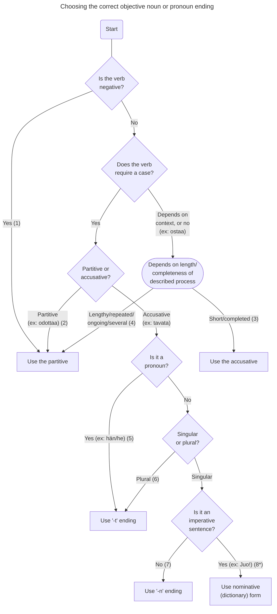

## Example sentences

(1) Minulla ei ole autoa/Älä juo olutta!

(2) Minä odotan häntä/Lisaa

(3) Ostan omenan (an apple)/omenat (apples)

(4) Ostan omenaa (some apple)/omenoita (some apples)

(5) Minä tapaan hänet/heidät

(6) Minä tapaan vanhemmat

(7) Minä tapaan Lisan

(8) Juo kahvi!

*: this could still be paritive if it is _some_ of the noun e.g. Juo kahvia!
